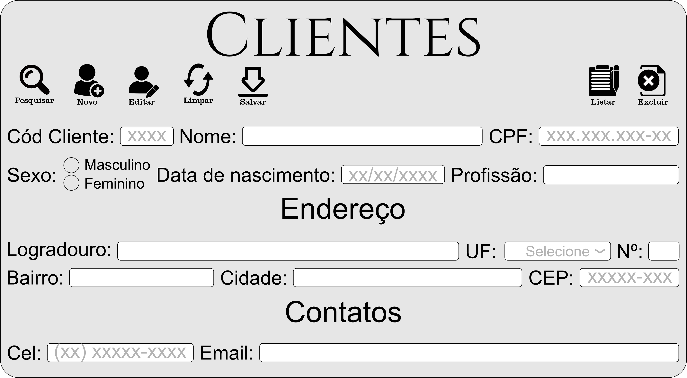

# Sistema de Clientes – CRUD POO em PHP

Sistema completo de cadastro de clientes desenvolvido em PHP com Programação Orientada a Objetos e arquitetura MVC simplificada. Permite criar, pesquisar, editar, excluir e listar clientes, utilizando PDO para acesso seguro ao MySQL. Mantém o front-end original com máscaras, validações e bloqueio de campos.

---

## 📁 Estrutura de Pastas

crud-poo/
│
├── app/
│ ├── Controllers/
│ │ └── ClienteController.php # Controla regras de negócio e fluxo das operações
│ ├── DAO/
│ │ └── ClienteDAO.php # Acesso ao banco (insert, update, delete, select)
│ ├── Database/
│ │ └── Conexao.php # Retorna a conexão PDO com o MySQL
│ ├── Models/
│ │ └── Cliente.php # Classe que representa o cliente (atributos do objeto)
│
├── frontend/
│ ├── css/
│ │ └── style.css # Estilos do layout e formatação visual
│ ├── img/ # Ícones usados nos botões e interface
│ ├── js/
│ │ ├── buttons.js # Lógica dos botões (novo, salvar, editar, limpar, listar)
│ │ ├── masks.js # Máscaras de CPF, celular, data e CEP
│ │ ├── pesquisar.js # Pesquisa com popup e seleção de resultados
│ │ └── script.js # Regras gerais da interface e controle de estados
│
├── public/
│ ├── index.html # Tela principal do sistema
│ ├── salvar.php # Recebe dados do front e envia ao controller (insert/update)
│ ├── pesquisar.php # Pesquisa cliente e retorna JSON para o front
│ ├── excluir.php # Remove cliente pelo ID
│ ├── listar.php # Retorna a lista completa de clientes
│ └── editar.php # Usado para carregar e atualizar via controller
│
└── sistema_clientes_poo.sql # Banco de dados MySQL

---

## 🔧 Instalação e Uso

### ✅ 1. Requisitos
- PHP 7+
- MySQL
- XAMPP ou WAMP
- Navegador

### ✅ 2. Instalar o Banco

1. Abra o **phpMyAdmin**  
2. Crie o banco: sistema_clientes_poo  
3. Importe o arquivo: sistema_clientes_poo.sql  

### ✅ 3. Executar o Sistema

1. Coloque o projeto dentro de: htdocs/ (XAMPP)  
2. Acesse no navegador: http://localhost/crud-poo/public/index.html

---

## ✅ Funcionalidades

✔ Cadastrar cliente  
✔ Pesquisar por código, nome, CPF, celular ou email  
✔ Selecionar resultado em lista quando houver mais de um  
✔ Editar cliente com bloqueio inteligente de campos  
✔ Excluir cliente carregado na tela  
✔ Listar todos em modal próprio  
✔ Máscaras de CPF, celular, data e CEP  
✔ Validação de campos obrigatórios  
✔ Código protegido (não editável, auto-incremento)

---

## 🖥️ Tela do Sistema

  

---

## 🗄 Backup do Banco

O arquivo: sistema_clientes_poo.sql  

contém estrutura e dados para restauração.

---

## 🛠 Tecnologias Utilizadas

- PHP (POO + MVC)
- MySQL (PDO)
- HTML5
- CSS3
- JavaScript
- XAMPP

---

## 👨‍💻 Créditos

Desenvolvido por **Willy Alves Borges**

---

